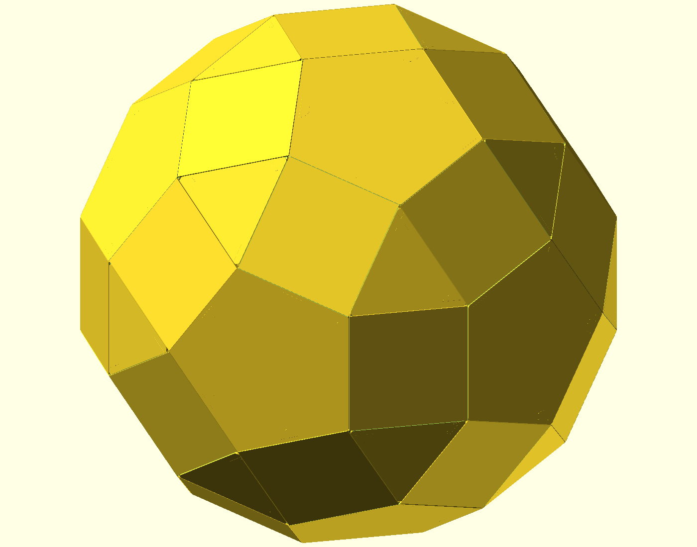
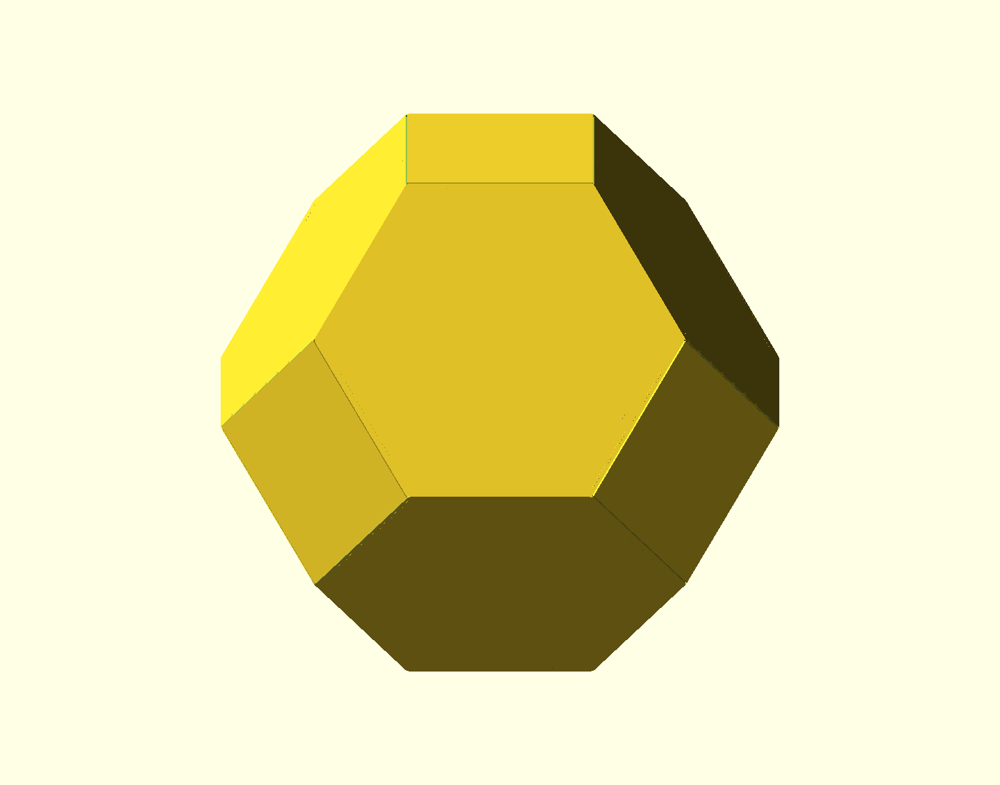
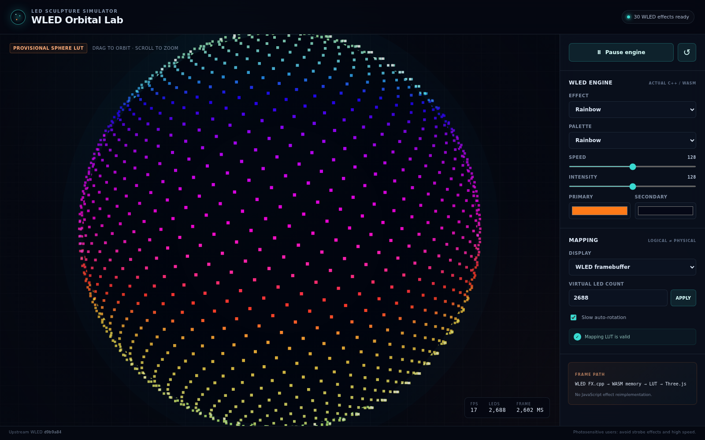

# JSON-driven polyhedral LED sculptures

A pose-first design, visualization, validation, and fabrication pipeline for
building physical LED sculptures from reusable panel hardware. A sculpture is
authored as JSON, previewed and edited in the browser, compiled into deterministic
LED and wiring maps, and regenerated as mechanically validated OpenSCAD, STL, and
preview artifacts.

The project began as a single 41-panel rhombicosidodecahedron. That sculpture is
now the flagship design and physical reference for a more general system that can
describe multiple polyhedra, place panels on their surfaces, preserve tested
mechanical constraints, and produce fabrication-ready closure geometry.

| Automatic 30-panel rhombicosidodecahedron | Six-panel cuboctahedron | Six-panel truncated octahedron |
| --- | --- | --- |
|  |  |  |

## What the platform does

- Defines sculptures, planar mechanical shells, panel profiles, poses, and
  surface attachments in runtime-validated JSON.
- Treats explicit right-handed panel bases as authoritative, so editor changes
  propagate to every LED, mounting hole, connector, and DIN/DOUT position.
- Provides browser authoring for adding, selecting, moving, rotating, and
  deleting panels on JSON surfaces, with optional GLB meshes used only as visual
  placement canvases.
- Generates visualizer mappings and provisional WLED wiring for arbitrary panel
  assemblies.
- Regenerates printable planar closures and rejects panels whose complete PCB
  envelope and clearance do not fit the containing face.
- Verifies authored and generated mechanics with TypeScript tests, schema
  round-trips, OpenSCAD rendering, and byte-equivalence checks for established
  sculptures.

The original rhombicosidodecahedron remains fully represented:

- 30 LED panels occupy its square faces.
- 11 additional LED panels sit in pentagonal openings.
- The north-pole pentagonal opening is intentionally unpopulated.
- 20 identical triangle fillers close the triangular openings.

The source geometry was migrated from the project's
[ChatGPT design conversation](https://chatgpt.com/share/6a78d835-25d0-83ed-a959-b31c6b7b4f29).
Git history is the version history; do not create numbered copies such as
`triangle_v2.scad`.

## Software and firmware

One ESP32 running WLED drives all 2,624 WS2812B pixels over four parallel
outputs. The revised per-output panel split still needs a physical chain
assignment. It runs custom audio-reactive effects locally and accepts realtime DDP
or Art-Net data. See [docs/software.md](docs/software.md) for the controller,
mapping, behavior, power-safety, and CI design.

The browser application includes **WLED Orbital Lab**, a standalone simulator
that runs genuine WLED C++ effect bodies in
WebAssembly and renders 2,624 LEDs as 30 square-face 8 x 8 panels plus 11
pentagon-centre 8 x 8 panels, leaving the north-pole pentagon open. The
displayed four-output route now generates the simulator's physical indices and
a fingerprint-matched provisional WLED map. Hardware export stays locked until
the remaining panel and wiring facts are bench-verified.



_This screenshot predates the open-pole correction; the live simulator now uses
the 41-panel vertex-up layout._

See [web/README.md](web/README.md) for setup, build, test, architecture, WASM
memory, mapping, and upstream-update instructions. Investigation details and
current limitations are recorded in [TECH_NOTES.md](TECH_NOTES.md).

### Run the local desktop editor

OpenSCAD 2021.01 is a system prerequisite for printable-part generation; it is
not bundled or installed by this repository. Install project dependencies once,
then build and start the production interface locally:

```bash
npm ci
npm run desktop
```

`npm run desktop` creates a fresh production web build before starting the
loopback server. Open the printed URL, normally `http://127.0.0.1:4173/`. Set
`ORBITAL_LAB_PORT` to choose another port and `OPENSCAD` to use an explicit
OpenSCAD executable:

```bash
OPENSCAD=/absolute/path/to/openscad ORBITAL_LAB_PORT=4300 npm run desktop
```

The browser reads actual generator status from the local server. If OpenSCAD is
missing or not version 2021.01, editing, simulation, mapping, wiring, and project
save/reopen remain available while **Generate 3D Parts** is disabled with repair
instructions. Install or repair OpenSCAD, then restart `npm run desktop` so the
startup probe runs again. Sculpture data, assets, and OpenSCAD stay on this
computer; there is no hosted generation service. Stop with Ctrl-C; SIGINT and
SIGTERM close the HTTP server and active generator processes cleanly.

## Canonical sculpture description

The compact authored source is
[`sculptures/rhombicosidodecahedron/sculpture.json`](sculptures/rhombicosidodecahedron/sculpture.json).
It references the reusable 66 x 65 mm panel hardware profile under `catalog/`.
The expanded 2,624-LED panel map and WLED ledmap are deterministic generated
artifacts rather than hand-authored sources. The same JSON now declares the 20
triangular openings and 11 populated pentagonal openings, including the
triangle filler, pentagon U-frame, middle connector, and their explicit panel
interfaces. Generated OpenSCAD entrypoints verify the existing tested parts
instead of duplicating them. See
[`docs/sculpture-format.md`](docs/sculpture-format.md) for the source contract,
validation command, and compilation flow.

The first independent recipe is the six-panel cuboctahedron. It compiles six
panel placements, eight integrated triangular closures, 24 real-hole tabs, a 384-LED
visualizer/WLED mapping, and prototype printable CAD from one JSON file. See
[`docs/cuboctahedron-e2e.md`](docs/cuboctahedron-e2e.md) for its generated
artifacts and physical-validation boundary.

## Browser sculpture authoring

WLED Orbital Lab now starts with an empty watertight cuboctahedron authoring
project whose six square faces are exactly 66 mm per side. Panels can be added,
selected, dragged, deleted, saved, and regenerated from the JSON shell without
a GLB. An optional GLB remains a positioning canvas only and never becomes
printable geometry.

The selected-panel transform gizmo moves a panel across local surface XY and
rotates it around its local Z axis without changing its centre offset, outward
normal, attachment triangle, or proven face angles. Run validates panel
envelopes against the stable planar JSON boundary, regenerates current topology,
and emits OpenSCAD, STL meshes, exact previews, wiring, and updated JSON. See
[docs/editor-mechanical-regeneration.md](docs/editor-mechanical-regeneration.md)
for the implemented mechanical contract and
[docs/pose-first-schema.md](docs/pose-first-schema.md) for the authoritative
pose model.

### Planned general project workflow

Mechanics-free authoring is implemented: load a referenced GLB, place panels
automatically, edit them by hand, and use the full simulator/mapping interface
before mechanics exist. A missing optional GLB does not invalidate saved poses.
The next fabrication milestone makes **Generate 3D Parts** close the gaps between panel outlines with
validated flat N-gon caps, validate one closed boundary, generate printable
parts, and load the exact emitted STL files in Three.js.

The portable project contract is a folder containing `sculpture.json` plus
safe relative, SHA-256-identified GLB and STL assets. Schema 2 defines generated
boundary and ordered exact-part references plus canonical current/stale
fingerprinting. Folder asset loading, boundary generation, exact-STL display,
and ZIP transport remain later roadmap slices. This workflow is specified in
[`docs/MECHANICS_WORKFLOW.md`](docs/MECHANICS_WORKFLOW.md).

## Canonical printable parts

| Source | Quantity | Purpose |
| --- | ---: | --- |
| `parts/triangle.scad` | 20 | Triangle filler with three PCB-safe mounts |
| `parts/pentagon_u.scad` | 11 installed | Pentagon U-frame holding an additional LED panel |
| `parts/middle_panel_connector.scad` | 11 installed | Rounded connector between the centre and outer panels |

Each source defaults to `mode = "print"`. Change the mode locally to inspect
its assembly/preview geometry, but do not commit a mode change unless it is an
intentional project change.

## Latest prototype renders

These previews and STL downloads always point to the current successful build
from `main`.

| Triangle filler | Pentagon U-frame | Middle-panel connector |
| --- | --- | --- |
| [](https://github.com/MateSteinforth/led-rhombicosidodecahedron/releases/download/latest-prototype/triangle.stl) | [](https://github.com/MateSteinforth/led-rhombicosidodecahedron/releases/download/latest-prototype/pentagon_u.stl) | [](https://github.com/MateSteinforth/led-rhombicosidodecahedron/releases/download/latest-prototype/middle_panel_connector.stl) |
| [Download STL](https://github.com/MateSteinforth/led-rhombicosidodecahedron/releases/download/latest-prototype/triangle.stl) | [Download STL](https://github.com/MateSteinforth/led-rhombicosidodecahedron/releases/download/latest-prototype/pentagon_u.stl) | [Download STL](https://github.com/MateSteinforth/led-rhombicosidodecahedron/releases/download/latest-prototype/middle_panel_connector.stl) |

## Known physical constraints

- PCB: 66 x 65 x 0.8 mm
- Corner-hole centres: 8 mm from the PCB edges
- Middle hole on a 66 mm edge: 25 mm from an outer hole
- Fasteners: M2
- Printed pilot: 1.6 mm
- Screw lead-in: 3.2 mm diameter x 0.7 mm deep
- Square/pentagon inside dihedral: 148.282526 degrees
- Small fold angle: 31.717474 degrees

See [refs/pcb_dimensions.md](refs/pcb_dimensions.md) and [AGENTS.md](AGENTS.md)
before changing geometry.

## Feature-focused tests

Automatic placement has a fast test path that does not generate CAD assets,
STLs, previews, or invoke OpenSCAD:

```bash
npm run test:placement
```

For the wider browser editor tests, including existing mechanical-regeneration
contracts that emit temporary OpenSCAD source, run:

```bash
npm run test:editor
```

`npm test` runs the complete Vitest suite without building or downloading
anything first. It uses the checked-in
`web/public/wasm/wled-engine.{js,wasm}` runtime. `npm run test:full` rebuilds
that runtime with an already installed pinned Emscripten SDK and then runs the
same suite.
Use `npm run verify` for the normal prepared-checkout verification: it regenerates
assets, builds WASM, runs all Vitest tests, runs `npx tsc -b`, and builds Vite. Printable geometry remains a separate,
explicit verification step through `npm run verify:cad` and
`npm run verify:processed-sculptures`.

## Clean checkout verification

A clean clone needs Git, Node.js 22, npm, Python 3, network access, and space for
the project-local Emscripten SDK. From the repository root, run:

```bash
npm run verify:clean
```

That command initializes and verifies the pinned WLED submodule, runs `npm ci`,
checks out the pinned emsdk installer revision, installs Emscripten 4.0.14,
regenerates repository assets, builds WASM, runs every Vitest test, runs
`npx tsc -b`, and builds the Vite application. It does not require generated
files from another checkout. The rebuilt
`web/public/wasm/wled-engine.{js,wasm}` files must match the committed runtime;
changes are committed together with the pinned source or compiler update. CI
executes the same essential sequence from `actions/checkout` with submodules
enabled.

For a checkout whose submodule, npm dependencies, and Emscripten SDK are already
prepared, run `npm run verify`. Neither `npm test` nor `npm run verify` downloads
the SDK.

## Build locally

Install the npm dependencies, OpenSCAD, Xvfb, and xauth. Generate the mapping,
WLED preview, CAD entrypoint, and CAD manifest with:

```bash
npm ci
npm run generate:assets
```

Verify that all three generated parts have the same CSG trees as their tested
sources, render their printable STLs, and create triangle and populated-pentagon
assembly previews with:

```bash
npm run verify:cad
```

Compile any explicit panel-assembly JSON, or regenerate all three processed
sculptures and their versioned printable meshes and preview renders:

```bash
npm run generate:sculpture -- --sculpture sculptures/cuboctahedron/sculpture.json
npm run verify:processed-sculptures
```

Verified snapshots are organized under
`artifacts/sculptures/<sculpture-id>/{3d,previews}`. The simulator reads
`sculptures/manifest.json` to populate its sculpture dropdown.

The canonical parts can still be rendered directly:

```bash
mkdir -p build
openscad -o build/triangle.stl parts/triangle.scad
openscad -o build/pentagon_u.stl parts/pentagon_u.scad
openscad -o build/middle_panel_connector.stl parts/middle_panel_connector.scad
```

Generated STL and PNG files belong in `build/` and are intentionally ignored.
GitHub Actions renders all three models on every push and pull request and
publishes the generated files as workflow artifacts. A separate CAD-contract
job regenerates the JSON-driven entrypoints, checks all three CSG pairs, and
renders the triangle and populated-pentagon assemblies before publishing is
allowed. Successful builds on
`main` also replace the assets in the single rolling
[Latest Prototype](https://github.com/MateSteinforth/led-rhombicosidodecahedron/releases/tag/latest-prototype)
release. That stable page shows the current PNG previews and STL downloads;
Git history remains the version history.

## Physical iteration workflow

1. Print the current model and record the physical fit result.
2. Discuss one focused correction and change the canonical source file.
3. Wait for the OpenSCAD workflow to succeed.
4. Inspect the previews on the **Latest Prototype** release from a phone.
5. If the edit is correct, download and print the current STL; otherwise,
   correct the source and render again.
6. Repeat without creating numbered source or generated-file copies.
